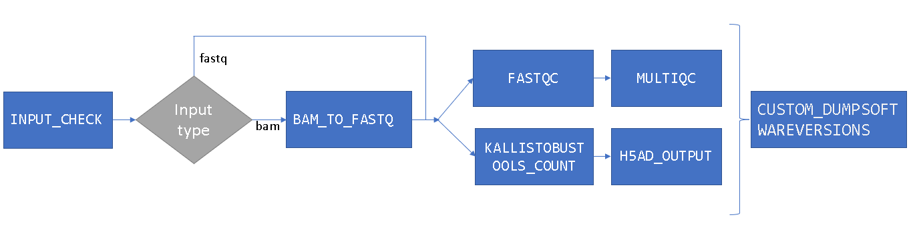
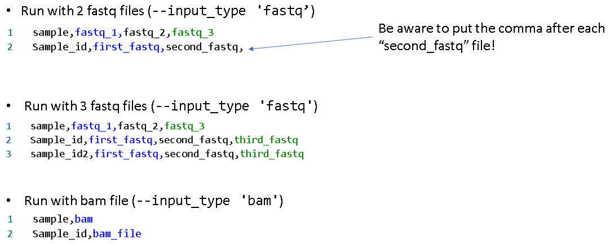

# nf-core-preprocessing

[](https://nf-co.re/preprocessing/results) [](https://doi.org/10.5281/zenodo.XXXXXXX) [](https://www.nextflow.io/) [](https://sylabs.io/docs/) [](https://nfcore.slack.com/channels/preprocessing)

## Workflow



<!-- TODO nf-core: Write a 1-2 sentence summary of what data the pipeline is for and what it does -->


## Pipeline summary

<!-- TODO nf-core: Fill in short bullet-pointed list of the default steps in the pipeline -->

1. Convert files from BAM to FASTQ (optional) ([`bamtofastq`](https://github.com/10XGenomics/bamtofastq))
2. Read QC ([`FastQC`](https://www.bioinformatics.babraham.ac.uk/projects/fastqc/))
3. Present QC for raw reads ([`MultiQC`](http://multiqc.info/))
4. kallisto|bustools counts ([`kb-tools`](https://www.kallistobus.tools/kb_usage/kb_count/))
    - Align reads to a reference transcriptome
    - Correct barcode errors
    - Produce a count matrix 
5. Rename H5AD files with given sample name

## Quick Start

1. Install [`Nextflow`](https://www.nextflow.io/docs/latest/getstarted.html#installation) 
2. Download the pipeline and test it on a minimal dataset with -profile test,singularity
   The test profile is fetching the samplesheet_test.csv (https://git.rwth-aachen.de/vleanu.alexandra/test-files/-/raw/main/samplesheet_test.csv) and you can skip some of the mandatory parameters since they are already passed in the configuration file for test. 

   > - The pipeline comes with config profile called `singularity` which instruct the pipeline to use the named tool for software management. For example, `-profile test,singularity`.


   ```console
   nextflow run vleanu.alexandra/nf-core-scrnaseq-pipeline -hub rwth -profile test,singularity \
   --index '/path_to_your/index.idx' \
   --t2g '/path_to_your/t2g.txt' \
   --t1c '/path_to_your/cdna_t2c.txt' \
   --t2c '/path_to_your/intron_t2c.txt' \
   --outdir '/path_to_your/output_directory' \
   ```


3. Build your own samplesheet.csv:

   

4. Start running your own analysis!

   ```console
   nextflow run vleanu.alexandra/nf-core-scrnaseq-pipeline -hub rwth -profile singularity \
   --input_type 'fastq' \
   --input '/path_to_your/samplesheet.csv' \
   --index '/path_to_your/index.idx' \
   --t2g '/path_to_your/t2g.txt' \
   --t1c '/path_to_your/cdna_t2c.txt' \
   --t2c '/path_to_your/intron_t2c.txt' \
   --workflow_mode 'lamanno' \
   --technology '10XV2' \
   --outdir '/path_to_your/output_directory'


   Options
   Mandatory parameters:
   -profile                Can run with singularity container if specified
   --input_type            Either a 'bam' or 'fastq' type of input
   --input                 The path to you samplesheet.csv which contains the BAM or FASTQ files.
   --index                 Path to index/indices for kallisto|bustools  
   --t2g                   Path to transcript-to-gene mapping for kallisto|bustools 
   --workflow_mode         Workflow to be used {standard,lamanno,nucleus,kite,kite:10xFB} eg: 'lamanno' 
   --technology            Technology to be used. (`kb --list` to view the supported technologies) eg: '10XV2' 
   --outdir                Path to your output directory 

   Required arguments for `lamanno` and `nucleus` workflows:
   --t1c                   Path to cDNA transcripts-to-capture for kallisto|bustools 
   --t2c                   Path to intron transcripts-to-captured for kallisto|bustools
   ```
## Credits

This pipeline was originally written by Alexandra Valeanu.

We thank the following people for their extensive assistance in the development of the pipeline: Zhambyl Otarbayev

<!-- TODO nf-core: If applicable, make list of people who have also contributed -->

## Citations

<!-- TODO nf-core: Add citation for pipeline after first release. Uncomment lines below and update Zenodo doi and badge at the top of this file. -->
<!-- If you use  nf-core/preprocessing for your analysis, please cite it using the following doi: [10.5281/zenodo.XXXXXX](https://doi.org/10.5281/zenodo.XXXXXX) -->

<!-- TODO nf-core: Add bibliography of tools and data used in your pipeline -->


> **The nf-core framework for community-curated bioinformatics pipelines.**
>
> Philip Ewels, Alexander Peltzer, Sven Fillinger, Harshil Patel, Johannes Alneberg, Andreas Wilm, Maxime Ulysse Garcia, Paolo Di Tommaso & Sven Nahnsen.
>
> _Nat Biotechnol._ 2020 Feb 13. doi: [10.1038/s41587-020-0439-x](https://dx.doi.org/10.1038/s41587-020-0439-x).
